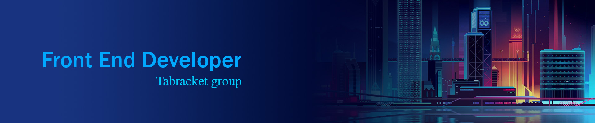

# title
### description

## Installation
To install this project, follow these steps:
1. Clone the repository: git clone https://github.com/majid-hatami-maleki/vowel-counter.git
2. Change to the project directory: cd to directory
3. open files in your IDE

### usages
- [![html][html-shield]][html-url]
- [![css][css-shield]][css-url]
- [![js][js-shield]][js-url]

### My contact links

[![discord][discord-shield]][discord-url]
[![linkedin][linkedin-shield]][linkedin-url]
[![outlook][outlook-shield]][outlook-url]
[![gmail][gmail-shield]][gmail-url]

> For contact me, Discord is preferred . ID : majidneo#6676

[discord-shield]: https://img.shields.io/badge/Discord-discord?logo=discord&logoColor=white&labelColor=%235661E0&color=%235661E0
[discord-url]: https://discord.gg/CCKB2zf4WV
[linkedin-shield]: https://img.shields.io/badge/Linkedin-linkedin%20link?logo=linkedin&logoColor=white&labelColor=%230B66C2&color=%230B66C2
[linkedin-url]: https://www.linkedin.com/in/majid-hatami-maleki-790257276/
[outlook-shield]: https://img.shields.io/badge/Outlook-email?logo=microsoftoutlook&logoColor=white&labelColor=%23106CBD&color=%23106CBD
[outlook-url]: mailto:majidhatamimaleki@outlook.com
[gmail-shield]: https://img.shields.io/badge/Gmail-email?logo=gmail&logoColor=white&labelColor=%23D02C1F&color=%23D02C1F
[gmail-url]: mailto:majidhatamimalekii@gmail.com
[html-shield]:https://img.shields.io/badge/html-HTML?logo=html5&logoColor=%23F86201&labelColor=black&color=black
[html-url]: https://developer.mozilla.org/en-US/docs/Learn/Getting_started_with_the_web/HTML_basics
[css-shield]:https://img.shields.io/badge/CSS%203-css?logo=css3&logoColor=%232762E9&labelColor=black&color=black
[css-url]: https://developer.mozilla.org/en-US/docs/Web/CSS
[js-shield]:https://img.shields.io/badge/javascript-es6?logo=javascript&logoColor=%23EFD81B&labelColor=black&color=black
[js-url]: https://developer.mozilla.org/en-US/docs/Web/JavaScript
[react-shield]: https://img.shields.io/badge/React.js-react?logo=react&logoColor=%2368DBFB&labelColor=%23313335&color=%23313335
[react-url]: https://react.dev/
[reactIcons-shield]:https://img.shields.io/badge/React%20Icons-reactIcons?logo=react&logoColor=%23FFFFFF&labelColor=%23EA2868&color=%23EA2868
[reactIcons-url]: https://react-icons.github.io/react-icons/
[bootstrap-shield]:https://img.shields.io/badge/Bootstrap-bootstrap?logo=bootstrap&logoColor=%23FFFFFF&labelColor=%238331F3&color=%238331F3
[bootstrap-url]: https://getbootstrap.com/
[fontAwesome-shield]:https://img.shields.io/badge/font%20awesome-font?logo=fontawesome&logoColor=%23FFFFFF&labelColor=%23213759&color=%23213759
[fontAwesome-url]: https://fontawesome.com/

